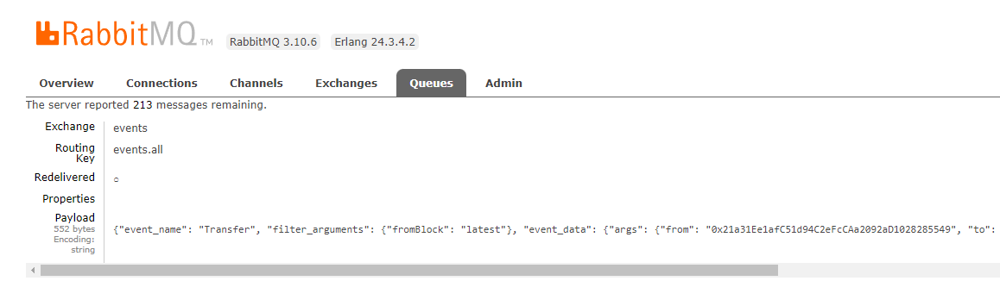

# bevents-scraper

## Description

_bevents-scraper_ reads specific events from a specific smart contract and passes them along to whoever is listening.

Smart contract events that are targeted are indicated in the `contract-watchlist.json` file

The json has the following format:
```json
{
  "contracts": [
    {
      "address": "<smart contract address>",
      "blockchain": "<only ethereum supported>",
      "abi": "<the smart contract ABI, or at least part of it that includes the event defitinion>",
      "events_to_listen": {
        "<event name>": {
          "argument_filters": {
            "fromBlock": "latest" // curently only fromBlock/toBlock: integer/tag is supported
          }
        }
      }
    },
  ...
  ]
}
```

A concrete example of listening to *Transfer* and *Approval* events emitted by the [SAND](https://etherscan.io/address/0x3845badAde8e6dFF049820680d1F14bD3903a5d0) token contract 
```json
{
  "contracts": [
    {
      "address": "0x3845badAde8e6dFF049820680d1F14bD3903a5d0",
      "blockchain": "ethereum",
      "abi": "[{\"constant\":true,\"inputs\":[],\"name\":\" ...\",\"type\":\"event\"}]",
      "events_to_listen": {
        "Transfer": {
          "argument_filters": {
            "fromBlock": "latest"
          }
        },
        "Approval": {
          "argument_filters": {
            "fromBlock": "latest"
          }
        }
      }
    }
  ]
}


```

## Setup

Simply clone the project and install the pip requirements (via venv or directly)
```shell
git clone https://github.com/abarbatei/bevents-scraper
pip install -r ./bevents-scraper/requirements.txt
```

You need to have an instance of a RabbitMQ server running. 
See the [official rabbitmq docker hub](https://hub.docker.com/_/rabbitmq/) container for a simple/fast deployment. 

## RabbitMQ interaction

The project reads each event and sends them over RabbitMQ routing key. 
In order to specify the queue/host and other configuration data, the following environment variables are required:
- `RPC_ENDPOINT_HTTPS_URL`: infura http endpoint URL or any other endpoint that supports [eth_newFilter](https://github.com/ethereum/execution-apis/blob/70c5668078910270c19dc9b5b6ff3cc174f308d4/src/eth/filter.yaml#L1) method  
- `RABBIT_HOST_URL`: the hostname of the RabbitMQ server
- `RABBIT_HOST_PORT`: port number used in the above-mentioned host
- `RABBIT_EXCHANGE`: rabbit exchanged used for the topic publish
- `RABBIT_ROUTING_KEY`: the routing key used in publishing the messages
- `RABBIT_USER`: the username when logging to the message broker
- `RABBIT_PASSWORD`: the password corresponding to the above-mentioned user


Example for a Windows .bat script:
<infura http URL or any other endoint that supports eth_newFilter>
```
@echo off
set RPC_ENDPOINT_HTTPS_URL=https://mainnet.infura.io/v3/<your_infura_API_key>
set RPC_ENDPOINT_WSS_URL=wss://mainnet.infura.io/ws/v3/<your_infura_API_key>

set RABBIT_HOST_URL=localhost
set RABBIT_HOST_PORT=5672
set RABBIT_EXCHANGE=events
set RABBIT_ROUTING_KEY=events.all
set RABBIT_USER=guest
set RABBIT_PASSWORD=guest
main.py
```

## Output message format

The queue messages will contain the following data

```json
{
    "event_name": "<the name of the smart contract event>",
    "filter_arguments": {
      // the arguments used as filter, specified in the contract-watchlist.json
    },
    "event_data": { // direct event data, raw, as returned by the RPC endpoint
        "args": {  
        },
        "event": "...",
        "logIndex": ...,
        "transactionIndex": ...,
        "transactionHash": "...",
        "address": "...",
        "blockHash": "...",
        "blockNumber": ...
    }
}

```
An example:
```json
{
    "event_name": "Transfer",
    "filter_arguments": {
        "fromBlock": "latest"
    },
    "event_data": {
        "args": {
            "from": "0x21a31Ee1afC51d94C2eFcCAa2092aD1028285549",
            "to": "0x7eFF6f6E021DA5770897A0736211A12E5306C8D0",
            "value": 125520000000000000000
        },
        "event": "Transfer",
        "logIndex": 397,
        "transactionIndex": 212,
        "transactionHash": "0x2053df7025ed8b48d26c66c1d9ca18643108cb6215dc105672a119066265c42e",
        "address": "0x3845badAde8e6dFF049820680d1F14bD3903a5d0",
        "blockHash": "0x94d8fa27ca9e5df6ff601fa66003de4532a2783a10ed26ca3a80ea391d23ea62",
        "blockNumber": 15187354
    }
}
```

You can also see these messages directly in the RabbitMQ interface if management plugin is added.


## Extending and testing

Extending the code is straightforward, clone, set it up and develop.
Testing is done using pytest, install development requirements for full required packages
`pip install -r requirements-dev.txt`

In order to run tests a subset of connections needs to be passed for object initialisations. 
Required configs are same as for the initial but with testing in (e.g. a local server).

Example start test script:
```bat
@echo off
set RPC_ENDPOINT_HTTPS_URL=https://mainnet.infura.io/v3/<your_API_key>
set RPC_ENDPOINT_WSS_URL=wss://mainnet.infura.io/ws/v3/<your_API_key>

set RABBIT_HOST_URL=localhost
set RABBIT_HOST_PORT=5672
set RABBIT_EXCHANGE=events
set RABBIT_ROUTING_KEY=events.all
set RABBIT_USER=guest
set RABBIT_PASSWORD=guest
py.test
```


